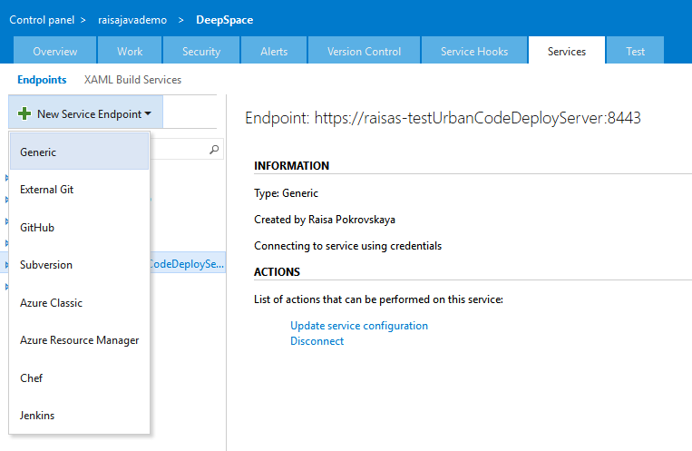
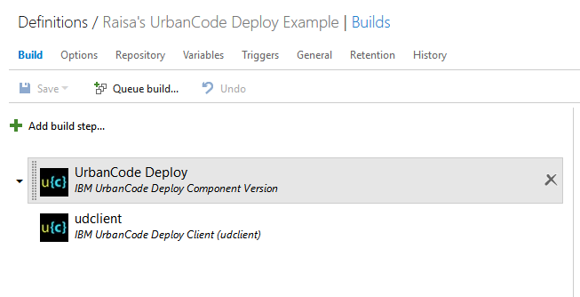
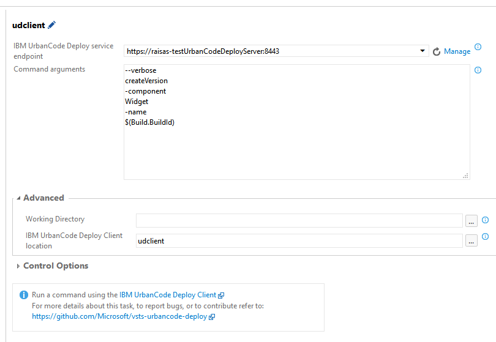

# Integrate with IBM&reg; UrbanCode Deploy
This extension provides build tasks that enable you to integrate with IBM UrbanCode Deploy using the [Command-line client](http://www.ibm.com/support/knowledgecenter/SS4GSP_6.2.1/com.ibm.udeploy.reference.doc/topics/cli_ch.html).

## Create a IBM UrbanCode Deploy Connection
Create a Generic Service Endpoint and specify your IBM UrbanCode Deploy endpoint URL, username and password, or just password for token autentication.

## Define your build process
Create a build definition to automate your build process. For detailed instructions on setting up a build definition, check out [this](https://msdn.microsoft.com/library/vs/alm/build/define/create).

Add one of the IBM UrbanCode Deploy Build tasks to your build steps and specify the input arguments.

Use the IBM UrbanCode Deploy Component Version task to easily create a component version for the build, upload files to the component, link back to the build, and tag the component.

Use the IBM UrbanCode Deploy Client task to run any command supported by the [IBM UrbanCode Deploy Command-line client](http://www.ibm.com/support/knowledgecenter/SS4GSP_6.2.1/com.ibm.udeploy.reference.doc/topics/cli_ch.html).

## Install the [IBM UrbanCode Deploy Command-line client](http://www.ibm.com/support/knowledgecenter/SS4GSP_6.2.1/com.ibm.udeploy.reference.doc/topics/cli_ch.html) on your build agent.
The task will look for the IBM UrbanCode Deploy Command-line client on the PATH of your build machine.  An alternate mechanism is to explicitly specify the location in the 'Advanced' section of the task.  This can be a local path on the build machine (for your own build machine).  You can also add udclient.jar to source control, and specify the path to it (for hosted build machines).  

## Learn more
More documentation is available [here](https://github.com/Microsoft/vsts-urbancode-deploy).

## License
The [code](https://github.com/Microsoft/vsts-urbancode-deploy) is open sourced under the MIT license. We love and encourage community contributions.

## Build pre-requisites
1. This package requires `node` and `npm`

## To compile, please run:
1. npm update
1. gulp

The vsix package will be produced in `_package`, and it can be uploaded to Visual Studio Team Services Marketplace for sharing.